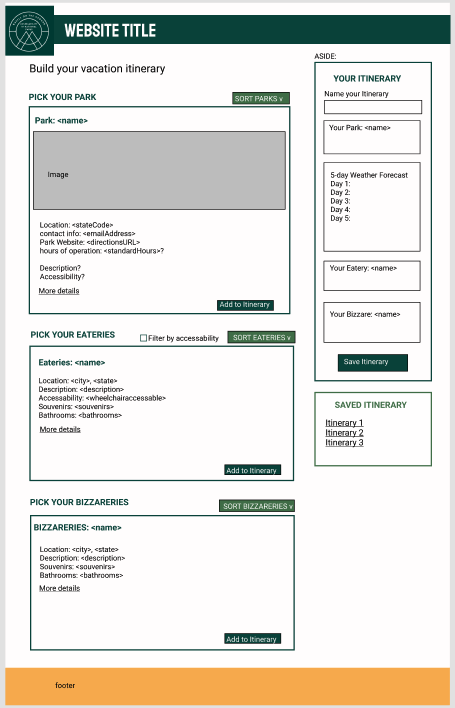
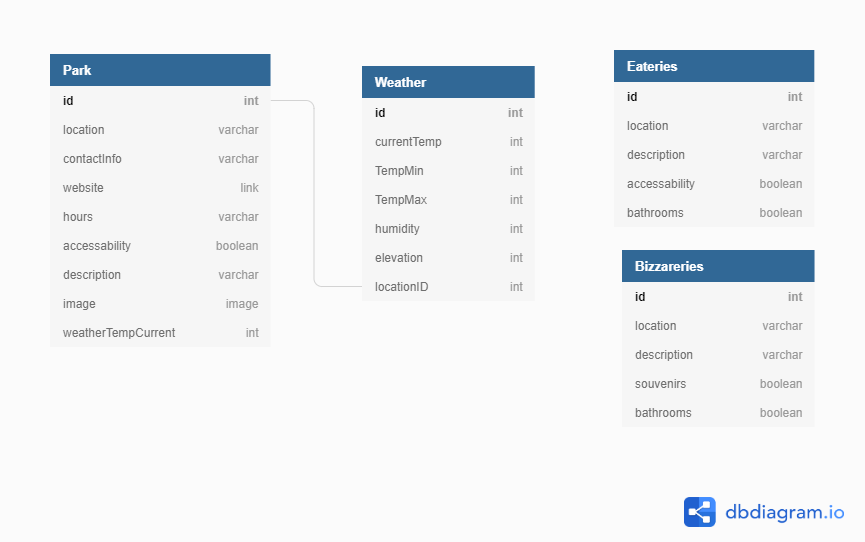
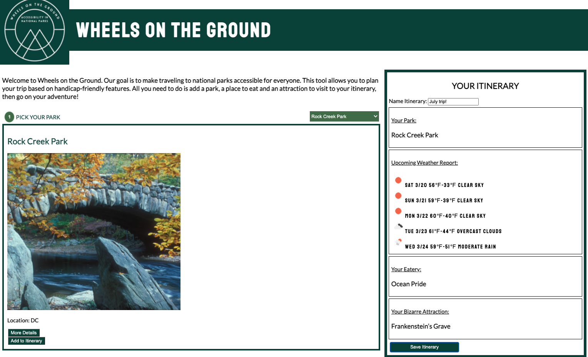
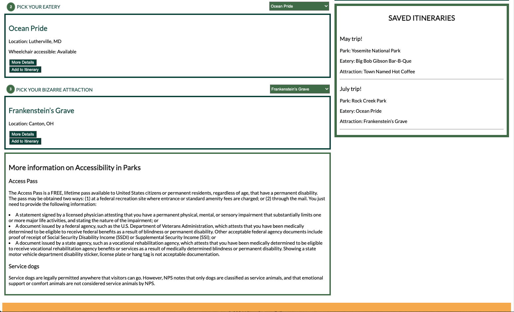

# Holiday Road from Nashville - A NSS C47 group project

## The Team

The team consisted of Chad Clark, Salma Crank, Laurel Morrison, and myself.
## Description

The goal for this project was to build an application that will allow people to build itineraries for their trips to the beautiful national parks of the United States. The starting point of each trip will be Nashville, TN, bu the destination will be a national park selected by the user. These trips also included one bizarre attraction and one eatery as well. Secondly, we wanted to build a site for a specific target audience that utilizes multiple API databases in JS. In the project we were given a list of personas to choose from to model our site for. Our persona we chose was Charles, who is handicapped and wheelchair bound. We wanted to create a site that would give people like Charles easy access to information that would be relevant to them, whether the park/eatery had wheelchair accessibility, whether wi-fi was available, and also a quick way to contact someone from the park in the event of an emergency.

## Noteworthy Successes

In this project we had to pull from 4 different APIs and combine the data into a saved itinerary object which we then saved to a database. It was also our first introduction to a sprint which is part of the Scrum framework for agile development. It was a great way to understand what each team member was working on everyday and enabled easy communication while working remotely.

## Our Persona

## Wireframe and ERD

## Preview Of The site

